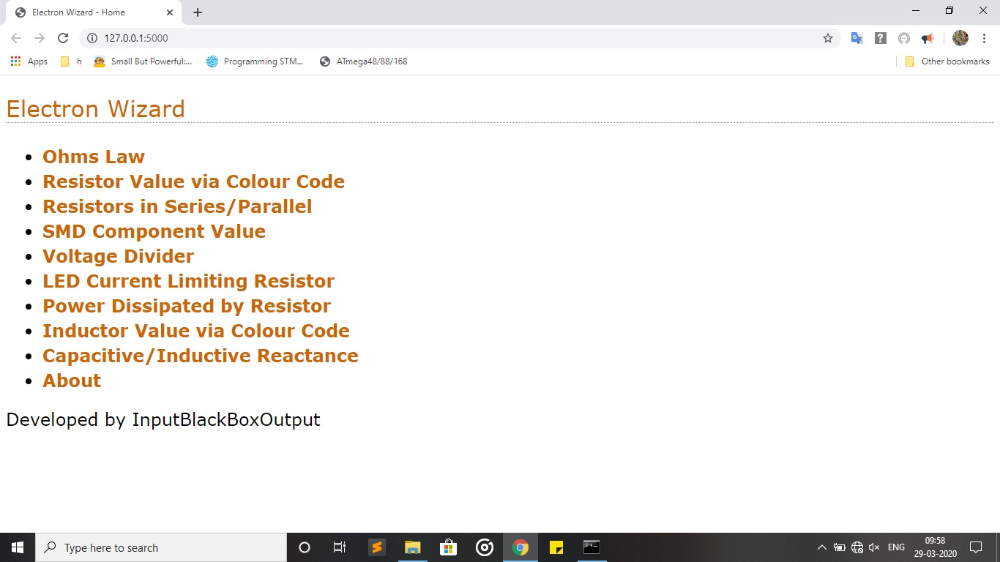
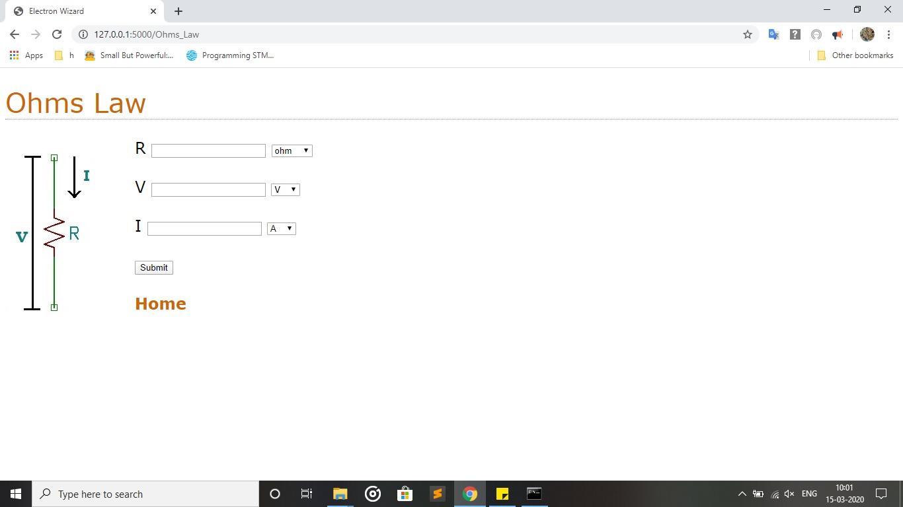
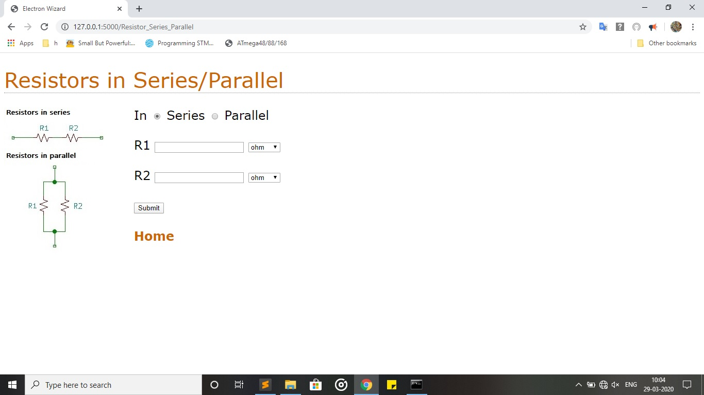

# Electron-Wizard
A webapp to help in designing of electronic projects

## Features
- Simple interface 
- Runs on any device with a browser and python (3.6 or above)

## This application contains calculator for the following
* Ohms law
* Resistors in series/parallel
* Resistor value via colour code
* SMD resistor/capacitor/inductor value
* Voltage divider
* LED current limiting resistor
* Power dissipated by resistor
* Inductor value via colour code
* Capacitive/Inductive reactance

# How to use this software ?
<b>Prerequisites</b>
* Any web browser
* Python 3.6 or above (Python can be downloaded from [www.python.org](https://www.python.org/) )

<b>Procedure for Windows </b>
1. Run <samp> modulesWindows.bat </samp> from scripts folder
1. Open the webapp by running <samp> ElectronWizard.bat </samp>

<b>Procedure for Ubuntu (Linux)</b>
1. Run <samp> modulesLinux.bat </samp> from scripts folder
1. Run command <code>python3 app.py</code>  in terminal to open webapp

# Screenshots
<kbd> </kbd>
  
<kbd> </kbd>
  
<kbd> </kbd>

### Made with lots of ⏱️, 📚 and ☕ by InputBlackBoxOutput
